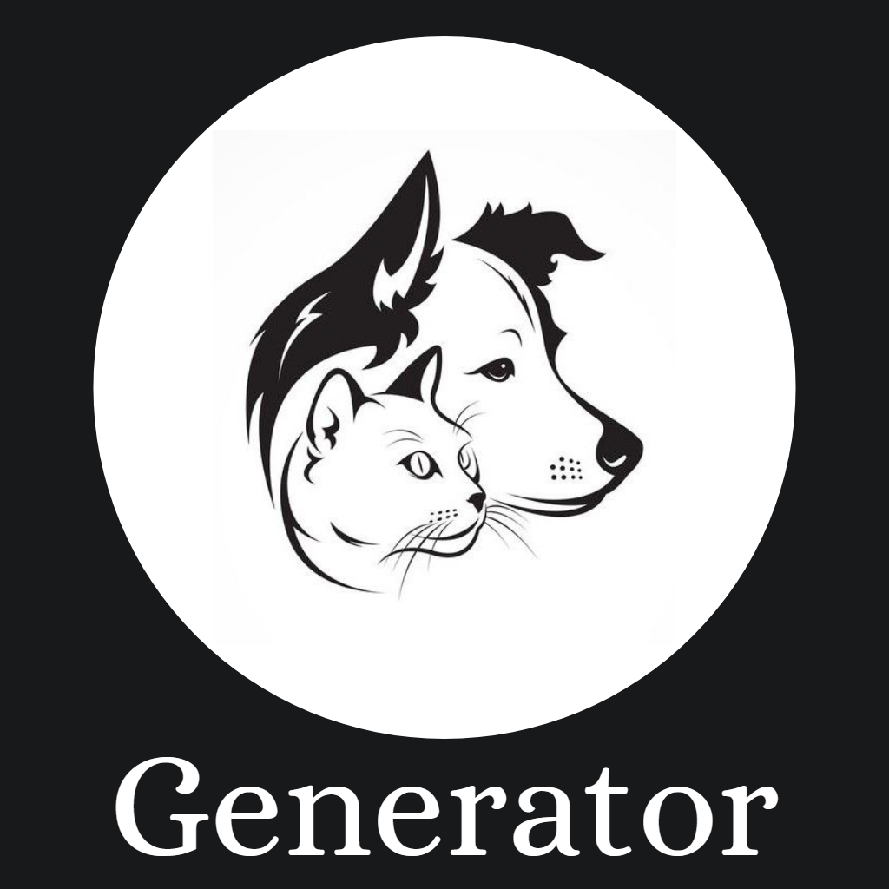

# Pet Generator

### *React Ionic App that consume multiple APIs to generate multiple Images, GIFS and Videos*

## Run Locally

- You have to need installed [Node JS](https://nodejs.org/en) and [Ionic](https://ionicframework.com/)
- Run this command `https://github.com/RafaGomezGuillen/pet-generator.git`
- Then in the folder project `npm install`
- `ionic serve` to launch the app by Web

On android
- `ionic build`
- `npx cap copy && npx cap sync`
- `ionic cap open android`. In Andriod Studio you have to run the app by simulating an Android device or connecting an Android device by USB.
- If you do not have android folder try `npx cap add android`

## Tech Stack
- TypeScript
- React TS
- Ionic 
- Capacitor

## APIs

- [Cataas](https://cataas.com/#/)
- [Dog API](https://dog.ceo/dog-api/)
- [Random.dog](https://random.dog/)